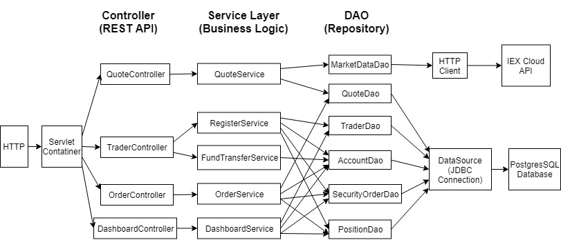

# Trading App

## Introduction

This application is an online stock trading simulation REST API wich allows users to execute market orders. Front end developers, mobile developers and traders can utilize this trading system. It is a MicroService which is implemented with SpringBoot. It uses IEX CLOUD API to get market data and use JDBC connection to store data into PostgresSQL database.

## Quick Start

**Prerequisites:**

- Docker (17.05 or higher which support multi-stage build)
- IEX token for getting market data (`https://iexcloud.io/docs/api/`) 

```
#you may or may not need sudo for docker cmds

#start docker
sudo systemctl start docker
#17.05 or higher
sudo docker -v

#create network bridge between SpringBoot app and postgreSQL
sudo docker network create --driver bridge trading-net

#build trading app
sudo docker build -t trading-app .

#build psql image
cd psql/
sudo docker build -t jrvs-psql .

#run a psql container
sudo docker run --rm --name jrvs-psql \
-e POSTGRES_PASSWORD=password \
-e POSTGRES_DB=jrvstrading \
-e POSTGRES_USER=postgres \
--network trading-net \
-d -p 5432:5432 jrvs-psql

#Setup IEX token
IEX_TOKEN='your_IEX_token'
#run a trading_app container
sudo docker run \
-e "PSQL_URL=jdbc:postgresql://jrvs-psql:5432/jrvstrading" \
-e "PSQL_USER=postgres" \
-e "PSQL_PASSWORD=password" \
-e "IEX_PUB_TOKEN=${IEX_TOKEN}" \
--network trading-net \
-p 5000:5000 -t trading-app

#verify health
curl localhost:5000/health
```

## REST API Usage

### Swagger
The Swagger UI is an open source project to visually render documentation for an API defined with the OpenAPI (Swagger) Specification. We are using Swagger UI because it is simple for this phase of our app.
To verify Swagger UI from your browser

```
localhost:5000/swagger-ui.html
```

### Quote Controller
We get market data (IexQuote) from IEX and cache the quote data in PostgresSQL.

Endpoints:

`/quote` Update a quote in the database, requires a Quote body

`/quote/iexMarketData` Update all the market data of existing quotes in database

`/quote/tickerId/{tickerId}` Create a new quote in database which ticker id is the path variable

`/quote/dailyList` List all securities that are available to trading in this trading system.

`/quote/iex/ticker/{ticker}` Return a IEX Quote which ticker id is the path variable 

### Trader Controller

Update a trader in the database, requires a Trader body

```
/trader
```

Delete a trader by trader id

```
/trader/traderId/{traderId}
```

Create a new trader account

```
/trader/firstname/{firstname}/lastname/{lastname}/dob/{dob}/country/{country}/email/{email}
```

Deposit money into account by account id

```
/trader/deposit/accountId/{accountId}/amount/{amount}
```

Withdraw money from account by account id

```
/trader/withdraw/accountId/{accountId}/amount/{amount}
```

### Order Controller

Execute the market order, requires a MarketOrderDto body

```
/order/marketOrder
```

### App Controller

Health check, if the program runs successfully, will return "I'm very healthy!"

```
/health
```

### Optional

Show portfolio view by trader id

```
/dashboard/portfolio/traderId/{traderId}
```

show trader account view by trader id

```
/dashboard/profile/traderId/{traderId}
```

## Architecture




## Improvements

1. Improve the security problems: adding sign up and log in functions.

2. Separating users and administrators accounts by groups, giving them different levels of permissions.

3. Add more available views to show in Dashboard Controller, such as diagrams that can see market data trending.

4. Make the app more user friendly: design our own UI instead of using Swagger.

5. For administrators: adding a function to directly enter SQL commands to let administrators get data from database.
